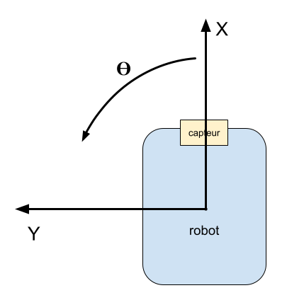

# Documentation pour l'utilisation du driver du robot du hackathon 2024

> L'ensemble des fonctions et objets qui permettent de programmer le robot est appelé **driver robot**.

## Structure du programme main.cpp
### Structure globale
Le fichier `src/main.cpp` est le programme principal du robot. c'est dedans que vous allez développer le code qui fera faire des actions à votre robot.

Le programme `main.cpp` est structuré de la façon suivante:
- Importation de la bibliothèque `Arduino.h` pour pouvoir utiliser les fonctions Arduino sur notre robot.
- Importation de la bibliothèque `Base.h` qui contient le driver du robot. C'est à dire l'ensemble des fonctions qui permettent de programmer le robot.

- Création d'un objet robot de type `Base`. C'est une sorte de grosse variable qui est de type `Base` comme on pourrait créer une variable de type `int`. Cette grosse variable possède des sous variables à elle (comme une structure si vous avez vu cela en Algo-prog) (ce sont des attributs) ainsi que des fonctions qui lui sont propres (des méthodes). Nous allons donc manipuler l'objet robot comme s'il s'agissait de notre robot pour lui faire faire des actions. Vous comprendrez mieux un peu plus loin dans le tuto.

Ensuite on trouve deux grosses fonctions qui se retrouvent dans tout programme Arduino:
- La fonction `setup()`
- La fonction `loop()`

La fonction `setup()` n'est exécutée qu'une seule fois au démarrage du microcontrôleur et elle contient généralement des initialisations. Pour le code de démo que vous avez au début, les instructions se trouvent aussi dans le `setup()` car on ne souhaite pas qu'elles s'exécutent plusieurs fois. Dans le cas contraire, on les aurais mises dans le `loop()`.

La fonction `loop()` quant à elle, est exécutée en boucle jusqu'à extinction de l'alimentation du microcontrolleur. C'est dedans que vous mettrez en général votre code qui n'est pas de l'initialisation.

### Les initialisations

Comme expliqué précédemment, les initialisations se trouvent dans la fonction `setup()` et ne sont exécutées qu'une seule fois. 

>Vous ne pouvez pas mettre votre code ailleurs que entre les balises ``/*Code utilisateur x*/`` et ``/*Fin code utilisateur x*/``

Les initialisations commencent par l'initialisation du port usb (``Serial.begin(9600)``).

S'en suit l'initialisation de l'embase du robot avec : ``robot.init()``. Cette fonction initialise le capteur et les moteurs ainsi que le système d'odométrie du robot (système de positionnement). En effet le driver du robot possède un système de positionnement qui permet de controller le robot en position.

Ensuite on initialise le bouton équipe ainsi que les Leds équipe. Les instructions ``pinMode()`` permettent de spécifier dans quel mode (INPUT ou OUTPUT) les pins du microcontrolleur se trouvent. Ici INPUT pour le bouton et OUTPUT pour les Leds.

Un test s'en suit pour afficher la couleur de l'équipe en fonction de la position du bouton équipe. Bien sur cette partie du code peut être modifiée car elle est entre les balises ``/* Code utilisateur 0 */`` et ``/* Fin code utilisateur 0 */``. Les fonctions ``digitalRead()`` et ``digitalWrite()`` permettent respectivement de lire ou écrire un état logique (HIGH ou LOW) sur la pin précisée en argument. Donc ici pour lire l'état du bouton et écrire l'état des leds.

S'en suit les balises  ``/* Code utilisateur 1 */`` et ``/* Fin code utilisateur 1 */`` entre lesquelles se trouvent le code que vous écrivez qui ne sera exécuté qu'une seule fois. Pour la démo ici on fait avancer le robot tout droit tant qu'il n'a pas atteint la position 1m sur l'axe X puis on le fait s'arrêter.

### Le coeur du programme

Dans la fonction `loop()` se trouvent les balises  ``/* Code utilisateur 2 */`` et ``/* Fin code utilisateur 2 */`` entre lesquelles vous pouvez écrire le code qui sera exécuté en boucle par le robot.

## Fonctions

Le driver mis à votre disposition pour controller le robot possède un grand nombre de fonctions pour vous permettre de faire réaliser simplement des actions au robot. Ces fonctions sont les suivantes :

| Fonction | Arguments | Retour | Description |
| - | - | - | - |
| void init(); | aucun | aucun | Initialise l'embase du robot |
| void run(rundir_t dir); | dir: FORWARD ou BACKWARD | auncun | Fait rouler le robot indéfiniment dans une direction donnée |
| void stop(void); | aucun | aucun | Arrête le déplacement du robot |
| uint16_t getSensorDistance(void); | aucun | distance en mm | renvoie la distance de la dernière mesure du capteur en mm (mesure automatique toutes les 200ms) |
| void printParams(void) | aucun | aucun | affiche les paramètres de position et de détection capteur du robot |
| void runDistance(double dist_m); | distance en m du déplacement (distance négative pour reculer) | aucun | Déplace le robot dans une direction sur une distance donnée |
| void turn(double angle_rad); | angle_rad: angle de rotation en radians | aucun | Fait tourner le robot d'un certain nombre de radians |
| double getPosX(void); | aucun | position en x du robot (m) | retourne la position en x du robot par rapport à sa position de départ |
| double getPosY(void); | aucun | position en y du robot (m) | retourne la position en y du robot par rapport à sa position de départ |
| double getAngle(void); | aucun | angle du robot (rad) | retourne l'angle du robot par rapport à sa position de départ |
| rundir_t getMotorsStatus(void); | aucun | statut des moteurs (FORWARD / BACKWARD / STOP) | renvoie le statut des moteurs pour tester si le robot est en train de rouler ou pas |

Exemple d'utilisation : 
```cpp
robot.runDistance(0.5);
delay(500);
robot.turn(90*DEG_TO_RAD);
delay(500);
robot.runDistance(0.5);
robot.printParams();
```

En plus de ces fonctions appliquées au robot, certaines fonctions issues de la librairie Arduino peuvent être utilisées :
- [Serial.print()](https://www.arduino.cc/reference/tr/language/functions/communication/serial/print/) et ses dérivées (printf, println)
- [digitalRead()](https://docs.arduino.cc/language-reference/en/functions/digital-io/digitalread/) uniquement sur le pin BOUTON_EQUIPE
- [digitalWrite()](https://docs.arduino.cc/language-reference/en/functions/digital-io/digitalwrite/) uniquement sur les pins LED1 et LED2
- [delay() et delayMicroseconds()](https://docs.arduino.cc/language-reference/en/functions/time/delay/) 
- [millis() et micros()](https://reference.arduino.cc/reference/en/language/functions/time/millis/) pour le temps écoulé
- [attachInterrupt()](https://www.arduino.cc/reference/tr/language/functions/external-interrupts/attachinterrupt/) si ca vous amuse
- [la librairie HardwareTimer.h](https://github.com/stm32duino/Arduino_Core_STM32/wiki/HardwareTimer-library) si vous êtes un peu maso sur les bords (TIM6 et TIM7 uniquement pour éviter de casser les moteurs)

**Merci de demander aux organisateurs avant d'utiliser toute autre fonction Arduino ou librairie pour éviter de casser les robots.**

### Position initiale du robot 

La position initiale du robot est la suivante : 



**Bonne programmation à tous !**

## Remerciements

Je voudrais adresser mes sincères remerciements pour leur aide lors du développement du projet robot Hackathon 2024 aux personnes suivantes :

- Jean-Paul Bourguet
- Kezia Marcou
- Raphael Comps
- Lucas Vincent
